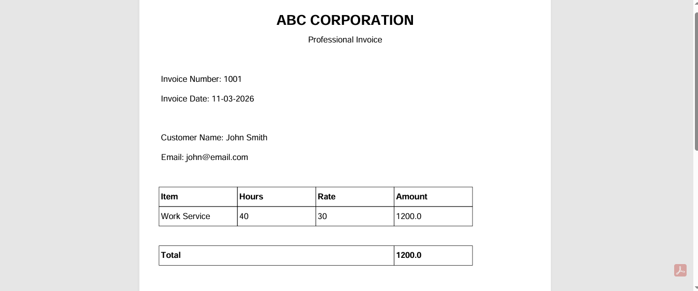

# Invoice Generator Automation

A Python automation tool that generates professional PDF invoices from a CSV file.

This project demonstrates how businesses can automatically generate invoices for multiple clients using Python.

---

## Features

* Generate invoices automatically
* Read client data from CSV
* Create professional PDF invoices
* Calculate totals automatically
* Batch invoice generation

---

## Tech Stack

* Python
* FPDF (PDF generation)
* CSV module

---

## Project Structure

```
invoice_generator_automation
│
├── data
│   └── clients.csv
│
├── invoices
│   └── sample_invoice.pdf
│
├── screenshots
│   └── invoice_output.png
│
├── main.py
├── requirements.txt
└── README.md
```

---

## Installation

Clone the repository

```
git clone https://github.com/poojashriram-1/invoice_generator_automation.git
```

Navigate to the project folder

```
cd invoice_generator_automation
```

Install dependencies

```
pip install -r requirements.txt
```

---

## Usage

Run the script

```
python main.py
```

The script will:

1. Read client data from CSV
2. Generate invoices
3. Save them in the `invoices` folder

---

## Example CSV Format

```
name,email,hours,rate
John Smith,john@email.com,40,30
Rahul Sharma,rahul@email.com,35,30
```

---

## Output

Generated invoices will be stored in:

```
invoices/
```

---

## Sample Invoice



---

## Use Cases

Small businesses can use this automation to:

* Generate monthly invoices
* Create billing reports
* Automate freelance billing

---

## Future Improvements

* Add company logo
* Multiple invoice items
* Email invoice to clients automatically
* Web interface for invoice generation

---

## Author

Python Automation Project for portfolio and freelance demonstrations.
